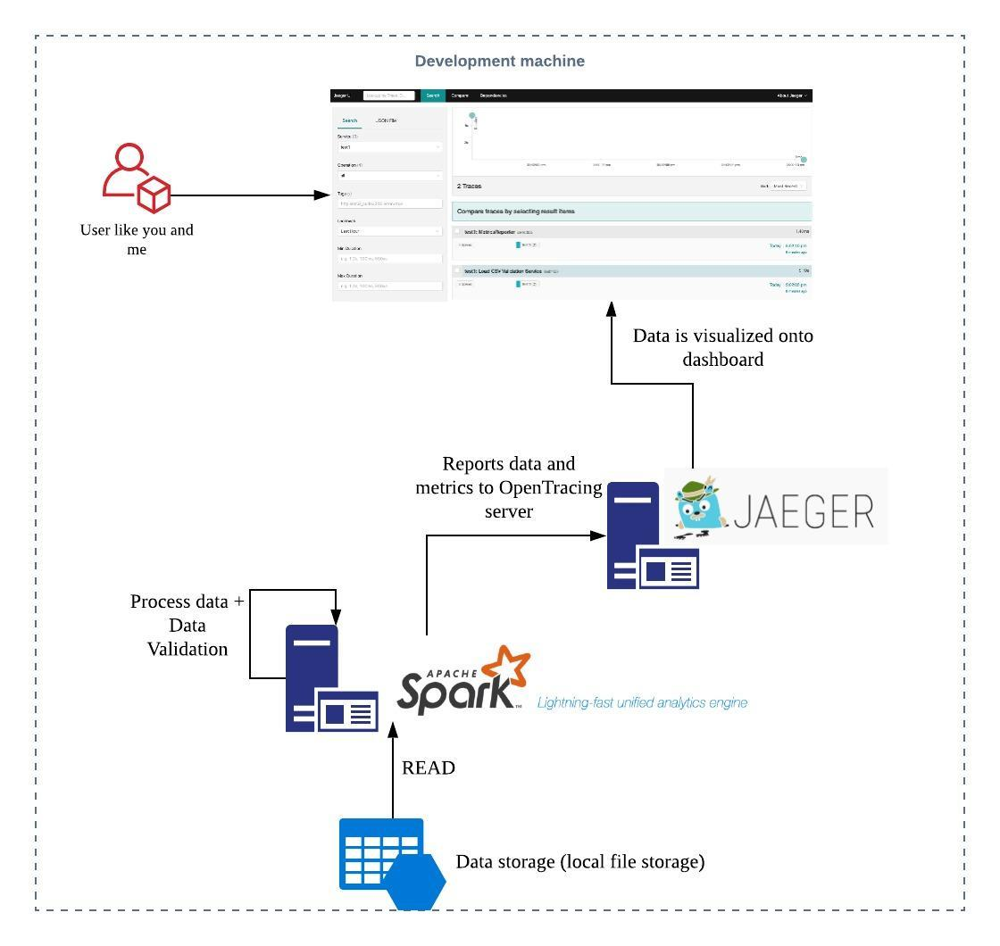

# Cautious Potato

What i am really here to discuss is to leverage a tool to discover some realities
about our data, especially more so when we start using Apache Spark and its
bretheren [Databricks](https://databricks.com) by investigating the kinds of
help we can expect from leveraging [deequ](https://github.com/awslabs/deequ);
which allows users to automate the data validation process by integrating the
tests into the ML pipelines. In case of violations,data can be quarantined and
data enginers can be automatically notified. Deequ is designed to scale to
datasets with billions of rows.

## Motivations

Data is at the center of modern enterprises. Online retailers, rely on data to
support customers making buying decisions to forecast demand or to schedule
deliveries. Missing or incorrect information seriously compromises any decision
process. A command trend across different industries is to automatge businesses
with machine learning (ML) techniques on large datasets. Data specific problems
with ML pipelines commonly occur because of two reasons:

- errorneous data
- missing data

In the former scenario, e.g. out-of-dictionary values for categorial variables
or accidental changes in the scale of computed features can cause ML pipelines
to unexpectedly change their predictions which is challenging to detect.
Furthemore, some model classers cannot handle missing data, and therefore
missing entries are commonly replaced by default values (this is a well-known
process, called _imputation_). These default values need to be carefully chosen
however as to not unexpectedly change the model's predictions.

### How is this experiment conducted

Below is an diagram i have setup on my local development machine:

### Examples

**Note:** All code is generated by the `tut` plugin; the original data source
is legitimate. If you like to re-generate the code docs, please re-run `tut`
again via `sbt`.

[Profiling Data](docs/profiler.md)

[Verifying Data](docs/verification.md)

[Analyzing Data](docs/analyzer.md)

